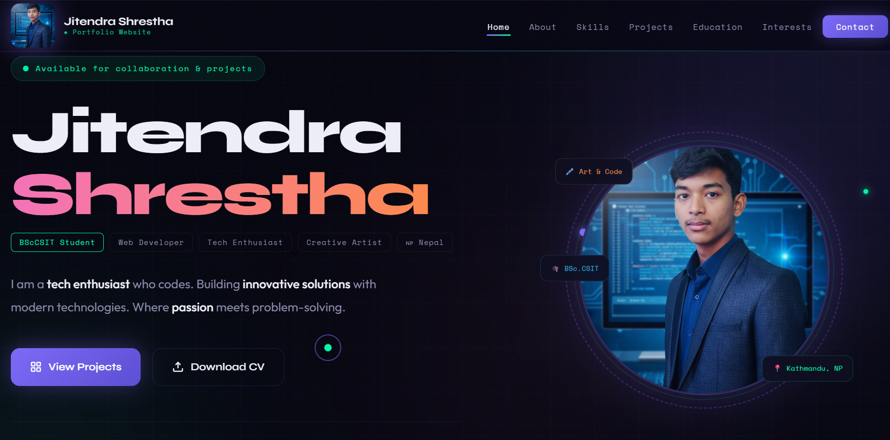

# 🌐 Personal Portfolio Website

Welcome to my personal portfolio repository! This website serves as a digital hub to showcase my frontend development skills, academic projects, and professional background.

## 🚀 Live Demo
You can view the live website here: **[https://jitendra-shrestha.com.np/?i=1]**

---

## 📸 Preview

---

## ✨ Features & Project Highlights

*   **Responsive Portfolio:** A clean, modern interface showcasing my background and skills (`index.html`).
*   **Interactive Age Calculator:** A built-in web tool that precisely calculates age based on user input (`age-calculator.html`).
*   **Downloadable CV:** Easy access to my latest professional resume directly from the site (`jitendra_cv.pdf`).

---

## 🛠️ Technologies Used

*   **HTML5** - Structured semantic markup
*   **CSS3** - Custom styling and layout design
*   **JavaScript** - Interactive logic for web tools (like the Age Calculator)

---

## 📁 File Structure Overview

*   `index.html` — Main landing page.
*   `age-calculator.html` — Dedicated application page for the Age Calculator.
*   `jitendra_cv.pdf` — Professional curriculum vitae.
*   `*.png` — Essential design assets, including profile pictures, project icons, and mockups.

---

📬 **Feel free to explore the code and reach out if you'd like to collaborate!**
